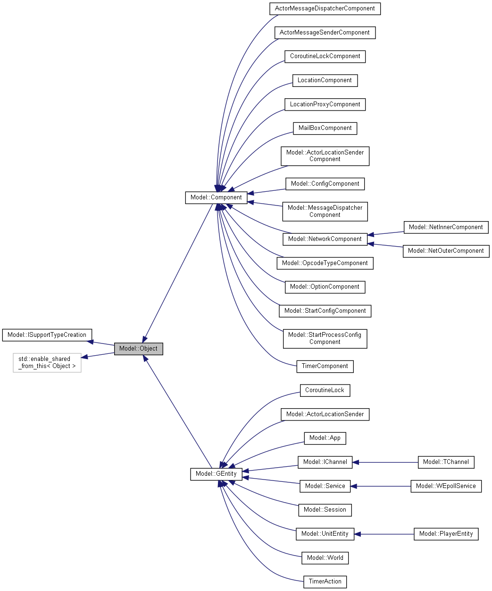

# ETC C++服务端框架 Beta
采用 ECS架构、协程，可以进行单线程无阻塞的方式进行开发。
ECS 参考了 [ET](https://github.com/egametang/ET) 设计思路。(将计划使用 dll/so 支持逻辑热重载)

## 使用的库

### [libgo](https://github.com/yyzybb537/libgo)

### [openssl](https://github.com/openssl/openssl)

### [spdlog](https://github.com/gabime/spdlog)

### [wepoll](https://github.com/piscisaureus/wepoll)

## 继承关系

## 缺少的功能

### 协程热更支持

## 编译
Win [下载Cmake](https://cmake.org/download/)

    安装 cmake 3.0+ 生成项目

Linux(未来会支持)

